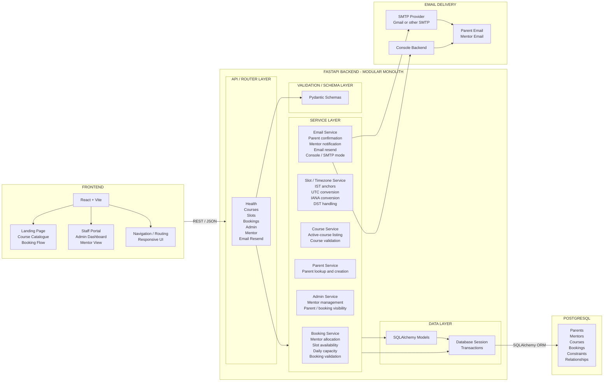
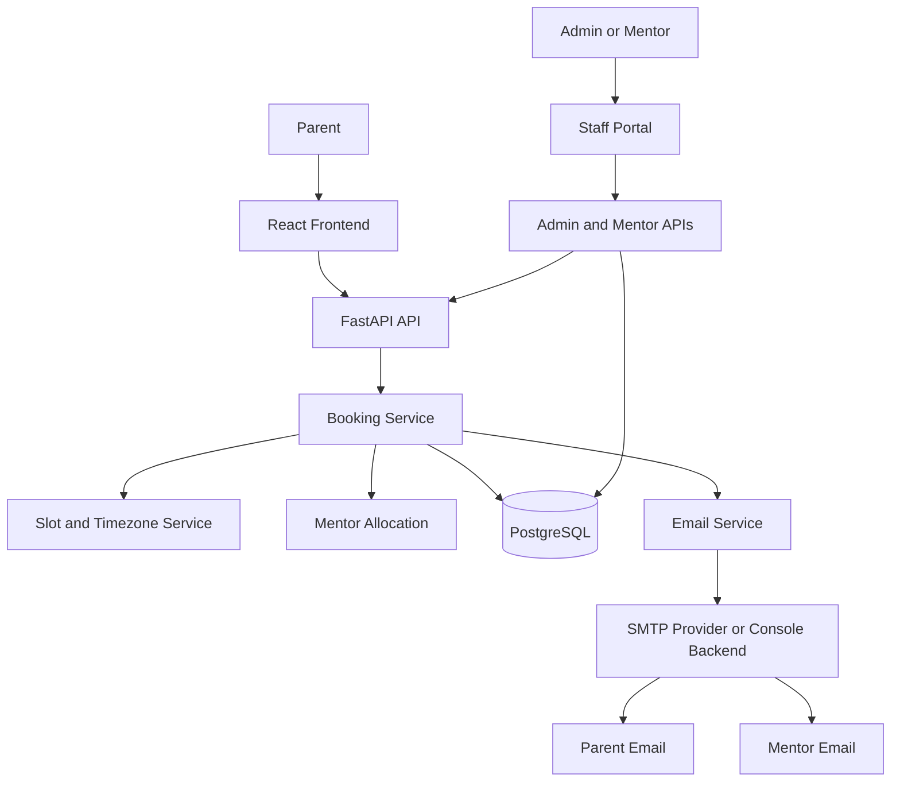
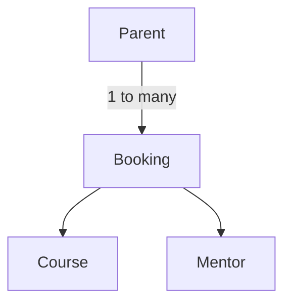

# Codeyoung Trial Class Booking System

## 1. Project Overview

This independent recruitment-assessment demonstration models a trial-class booking journey for parents and India-based mentors:

1. A parent enters the public platform and explores the course catalogue.
2. The parent selects a course, date, and timezone.
3. The system displays available trial slots in the parent's local time.
4. The parent enters parent and student details and submits a booking.
5. The FastAPI backend validates the request and automatically assigns an available mentor.
6. A unique dummy classroom link is generated and stored with the booking.
7. The frontend displays the confirmation and copyable classroom link.
8. Parent and mentor notification content is prepared in their relevant local time; delivery uses console simulation by default or configured SMTP.

The project is intentionally scoped as a focused assessment implementation, not as the official Codeyoung website or a production platform.

## 2. Assignment Requirements

| Assignment Requirement | Implementation | Evidence/Location |
|---|---|---|
| Parent chooses convenient trial slot | Parent selects a date and available one-hour slot displayed in the selected timezone. | `frontend/src/pages/BookingPage.jsx`, `backend/routers/slots.py` |
| Automatic mentor assignment | Backend filters eligible active mentors and selects the lowest mentor ID. | `backend/services/booking_service.py` |
| 10 mentors | Idempotent seed data defines ten fictional active mentors in `Asia/Kolkata`. | `backend/db/seed.py` |
| Maximum 2 demo classes per mentor per day | Confirmed bookings are counted by IST calendar date; mentors at two are excluded. | `backend/services/booking_service.py`, `backend/services/slot_service.py` |
| Parent and mentor receive class link | The same generated link is included in parent and mentor notification content and exposed in confirmation/mentor views. | `backend/services/email_service.py`, `frontend/src/components/BookingConfirmation.jsx` |
| Timezone-aware experience | IANA timezone selection/detection and server-side UTC-to-local conversion. | `backend/services/timezone_service.py`, `frontend/src/components/TimezoneDatePicker.jsx` |
| Local-time communication | Parent email uses the parent's timezone; mentor email uses IST. | `backend/services/email_service.py` |
| DST handling | Python `zoneinfo`/`tzdata` applies IANA DST rules. | `backend/services/timezone_service.py`, `backend/tests/test_timezone.py` |
| Dummy class link | A UUID-based `https://class.codeyoung.com/room/<uuid>` link is generated. | `backend/services/booking_service.py` |
| No mentor available error state | No eligible mentor raises HTTP 409 Conflict and the frontend displays an error state. | `backend/routers/bookings.py`, `frontend/src/pages/BookingPage.jsx` |
| React frontend | React 19 application bundled with Vite. | `frontend/package.json`, `frontend/src/` |
| Python backend | FastAPI application using Pydantic and SQLAlchemy. | `backend/main.py`, `backend/requirements.txt` |
| README | This recruiter/evaluator-facing document. | `README.md` |
| Full AI transcript | The complete exported transcript is provided. | `TRANSCRIPT.md` |

The assignment describes around 20 interested parents per day as demand/context, not as a hard global booking limit. With 10 mentors and a maximum of 2 classes per mentor per IST calendar day, the theoretical mentor-class capacity is 20 assignments per IST calendar day.

## 3. Complete Feature Set

### Public/User Features

- Responsive public landing page with hero, course section, how-it-works content, features, testimonials, FAQ, CTA, and footer.
- Backend-backed active course catalogue.
- Course-specific booking flow with URL course selection support.
- Date selection across the configured future booking window.
- Browser timezone detection with a curated timezone selection interface.
- Timezone-aware slot display and DST-aware conversion.
- Parent and student information form with client-side validation.
- Booking confirmation showing booking reference, scheduled time, assigned mentor label, and classroom link.
- Copyable classroom link and join/open classroom action.
- Loading, validation, connectivity, conflict, and empty-slot states.
- Responsive mobile/desktop layout and public section navigation.
- Login/demo portal entry for Admin and Mentor views; Student access is intentionally unavailable.
- Privacy Policy, Terms of Use, and recruitment-project disclaimer UI placeholders.

### Booking & Scheduling Engine

- Filters to active mentors only.
- Excludes mentors already assigned at the exact UTC slot.
- Excludes mentors with two or more confirmed bookings on the same IST calendar date.
- Selects an eligible mentor deterministically by ascending mentor ID.
- Stores the canonical appointment instant as a timezone-aware UTC timestamp.
- Generates seven IST anchors at 15:00 through 21:00, inclusive, in one-hour increments.
- Validates IANA timezone identifiers.
- Validates UTC-aware timestamps, top-of-hour alignment, allowed IST hours, and the future booking window.
- Rejects invalid, stale, out-of-window, or inactive-course booking requests.
- Returns HTTP 409 when no mentor is available.
- Uses a named unique `(mentor_id, slot_utc)` database constraint as a same-mentor/same-slot guard.
- Requests PostgreSQL `SERIALIZABLE` transaction handling and retries retryable serialization, deadlock, or unique-conflict failures once.
- Returns HTTP 503 if a retryable concurrency failure persists.

### Email & Notifications

- Builds a parent confirmation email containing course, student, mentor, time, timezone, booking reference, and classroom link.
- Builds a mentor assignment email containing course, student, parent, IST time, booking reference, and the same classroom link.
- Renders parent notification time in the parent's IANA timezone.
- Renders mentor notification time in `Asia/Kolkata`.
- Supports `EMAIL_BACKEND=console` for local development; console delivery logs the message and records a bounded in-memory recent-email queue.
- Supports `EMAIL_BACKEND=smtp` through Python `smtplib`.
- Reads SMTP host, port, username, password, sender, and TLS settings from environment configuration.
- Commits the booking before notification dispatch; notification errors are caught/logged and do not roll back a confirmed booking.
- Supports admin and mentor resend actions with parent/mentor recipient selection and an optional custom subject.

### Admin & Staff Features

- Staff Portal entry page with Admin and Mentor demo navigation.
- Explicit notices that production authentication and role-based access control are not implemented.
- Admin dashboard with dynamic capacity and operational metrics.
- Mentor roster with status, timezone, upcoming class load grouped by IST date, and capacity indicator.
- Mentor create, read, edit, activate/deactivate, and conditional delete operations.
- Mentor timezone validation and duplicate-email protection.
- Parent directory with confirmed booking counts.
- Parent booking-history inspection.
- Confirmed booking list with parent-local and mentor-IST times, course, assigned mentor, and classroom link.
- Email resend from admin and mentor screens.
- Mentor view with mentor selector, upcoming assigned-class schedule grouped by IST date, parent contact, course, status, classroom link, and resend action.
- Staff navigation between Staff Home, Admin Dashboard, Mentor View, and the public website.

### Course Management

- Complete public course listing fetched dynamically from the database.
- Admin course management implemented via the Admin Dashboard UI and backend API.
- Admin capabilities include viewing, adding, editing, and activating/deactivating courses.
- Course validation enforces required fields (name, description, age range, level) and prevents duplicate names.
- Inactive courses cannot be selected for new bookings, but existing bookings linked to them remain intact.
- Current seeded course catalogue includes:
  - Coding Fundamentals
  - Python Programming
  - Web Development
  - AI & Robotics
  - Game Development
  - App Development
  - Data & Analytics

## 4. Application Architecture



## 5. Engineering Decisions

### Why FastAPI?
- **Python Backend:** Familiar, powerful, and easy to orchestrate.
- **Pydantic Validation:** Strict API contracts and data serialization.
- **Clean REST API Structure:** Intuitive route organization.
- **Service-Layer Separation:** Business logic is decoupled from HTTP concerns.
- **Lightweight:** Perfectly fits this assessment without the overhead of heavier frameworks.

### Why PostgreSQL?
- **Relational Booking Data:** Parents, mentors, courses, and bookings have strict relational ties.
- **Foreign Keys:** Ensure data integrity (e.g., preventing deletion of mentors with active bookings).
- **Unique Constraints:** Essential for ensuring a mentor isn't double-booked.
- **Transactions:** Safely handles concurrency-sensitive booking allocations.

### Why UTC + IANA timezones?
- **Canonical Instant:** UTC serves as the absolute source of truth for the booking instant.
- **IANA identifiers:** Allows robust timezone conversion independent of client localization quirks.
- **Anchored Scheduling:** Mentor scheduling logic always evaluates against Asia/Kolkata (IST).
- **Derived Display:** Parent-facing times are derived from the UTC instant at runtime.
- **DST-aware:** Python’s `zoneinfo` and `tzdata` gracefully handle daylight saving time boundaries.

### Why SERIALIZABLE?
- **Concurrency Protection:** Concurrent parents may request bookings for the same slot simultaneously.
- **Consistency:** Mentor eligibility and booking creation must remain consistent to avoid overbooking.
- **Transaction Isolation:** PostgreSQL `SERIALIZABLE` isolation combined with the `UNIQUE(mentor_id, slot_utc)` constraint provides strong database-level protection.
- **Resilience:** The application catches serialization failures and automatically retries once, smoothing out occasional concurrency collisions.

### Why maximum 2 classes/day?
- **Assignment Constraint:** This is an explicit requirement from the prompt.
- **IST Boundary:** The daily count is calculated strictly against the Asia/Kolkata calendar date, rather than a rolling 24-hour window.

### Why modular monolith?
- **Single Bounded Domain:** The application deals exclusively with trial class bookings.
- **Shared Transaction Boundary:** Mentor allocation requires immediate consistency with booking creation.
- **Deployment & Maintenance:** Simpler to deploy and maintain than microservices for this assessment.
- **Avoids Complexity:** Prevents unnecessary network latency, distributed transaction logic, and operational overhead.

## 6. System Flow



## 7. Booking Flow

1. The parent selects a course.
2. The parent selects an IST calendar date.
3. The parent selects or confirms an IANA timezone.
4. The backend generates IST anchors, converts them to UTC and parent-local display values, and filters unavailable slots.
5. The parent selects an available slot.
6. The parent submits parent and student details.
7. The backend validates the course, timezone, UTC timestamp, slot shape, allowed hours, and date window.
8. Mentor eligibility is calculated using active status, exact-slot occupancy, and IST-day capacity.
9. An eligible mentor is selected deterministically.
10. The normalized parent is created or reused and the booking is committed.
11. A UUID-based dummy classroom link is generated as part of the booking record.
12. Parent and mentor notification content is dispatched through console or configured SMTP after commit.
13. The booking response returns to React and the confirmation view displays the result and link.

## 8. Timezone and DST Design

- Inputs use IANA timezone identifiers such as `America/New_York` and `Europe/London`.
- Mentor scheduling is anchored in `Asia/Kolkata` (IST), which is treated as the scheduling reference zone.
- The backend converts IST anchors to UTC and treats UTC as the canonical appointment representation.
- The frontend displays the server-provided local representation rather than recomputing the selected instant for submission.
- Parent email content is formatted in the parent's timezone; mentor email content is formatted in IST.
- Python `zoneinfo` and the pinned `tzdata` package apply DST rules without manual offset arithmetic.
- Mentor daily capacity is calculated using the IST calendar date derived from `slot_utc`.

*Note: The one-hour class duration, 15:00-21:00 IST anchors, and tomorrow-through-seven-days-ahead booking window are engineering/product decisions implemented by the current code, not explicitly mandated assignment requirements.*

## 9. Data Model



- **Parent:** normalized identity keyed by unique email; one parent may have multiple bookings.
- **Booking:** appointment record containing parent, mentor, course, canonical slot, timezone, status, classroom link, and creation timestamp.
- **Course:** selectable course with unique name, description, active state, and creation timestamp.
- **Mentor:** mentor identity, unique email, IANA timezone, and active state.
- **Foreign keys:** bookings reference parents, mentors, and courses with restrictive deletion behavior.
- **Booking integrity:** `uq_mentor_slot_utc` prevents one mentor from occupying the same UTC slot twice.

## 10. Maintainability & Code Quality

- React components are strictly separated by responsibility (e.g., `CourseSelector.jsx`, `SlotPicker.jsx`).
- Backend routers exclusively handle HTTP concerns.
- Service modules contain pure business and orchestration logic.
- Pydantic schemas define API contracts and handle runtime validation.
- SQLAlchemy models represent persistence cleanly.
- Timezone calculations and email dispatching are isolated into dedicated service modules.
- Booking, mentor, parent, course, and admin responsibilities are separated throughout the backend.
- Tests are organized by behavior and responsibility.
- The frontend relies on minimal external dependencies, utilizing vanilla CSS for styling.
- Database constraints provide a robust additional integrity boundary.
- Documentation is modularized into architecture, API, database, testing, and development guides.

## 11. Testing & Verification

**Latest backend verification:** 71 passed, 0 failed, 0 skipped. (The run reported 11 warnings).

Confirmed tested areas include:
- Mentor assignment and inactive mentor exclusion.
- Same mentor/same slot conflicts and concurrent booking attempts.
- 0/1/2 daily capacity and separate IST calendar date boundaries.
- No mentor available error state.
- Invalid timezone, datetime, slot, and course validations.
- Booking-window boundaries and UTC/IST date boundaries.
- Database unique constraints.
- Timezone/DST behavior (including US EDT/EST and UK BST/GMT).
- Email formatting, delivery modes, and admin resend functionality.
- Admin metrics and course/mentor management operations.

**Frontend Verification:**
- `npm run build`: passed successfully.
- `npm run lint`: exits successfully with one existing warning in `BookingPage.jsx` for an unused catch parameter.
- Public home, course selection, booking flow, and confirmation views are verified.
- Admin and Mentor staff views are verified.
- The staff portal demo notice is prominently verified.
- Mobile layout was checked at 390x844 with no horizontal overflow observed.

## 12. Deliberate Non-Features

The following were intentionally kept out of scope to focus on the core assessment requirements:

- Production authentication (JWT/OAuth) and Role-Based Access Control (RBAC).
- Real video conferencing API integration.
- Payment processing or subscription handling.
- Calendar synchronization (Google Calendar / Outlook).
- Full CRM or enterprise administration features.
- Complex asynchronous notification queues and observability.
- Microservices and distributed transactions.
- Production deployment infrastructure setups.
- Alembic migration framework (the project uses a simpler database initialization/migration approach).

## 13. Production Considerations

While this implementation fulfills the assignment, it is an assessment demonstration, not a real production deployment. A production-ready version would require:

- **Authentication & RBAC:** Implementing secure login and role-based access for the staff portal.
- **Email & Monitoring:** Integration with a production email provider (e.g., SendGrid/AWS SES) with delivery tracking and monitoring.
- **Database Migrations:** Transitioning to a robust schema migration tool like Alembic.
- **Rate Limiting:** Protecting public booking routes from abuse.
- **Observability:** Implementing structured logging and application metrics.
- **Secrets Management:** Using secure secret managers rather than simple `.env` files for production credentials.
- **Deployment & Backup:** Setting up CI/CD, database backups, and disaster recovery plans.

## 14. Setup and Running

### Prerequisites

- Python 3.13 for the backend.
- Node.js/npm for the Vite frontend.
- PostgreSQL running locally or accessible via URL.

### Backend Environment

From the repository root:

```powershell
cd backend
python -m venv .venv
.venv\Scripts\Activate.ps1
pip install -r requirements.txt
Copy-Item .env.example .env
```

Edit `backend/.env` and set `DATABASE_URL`. Optional email settings include `EMAIL_BACKEND` (defaults to `console`), `SMTP_HOST`, `SMTP_PORT`, `SMTP_USERNAME`, `SMTP_PASSWORD`, and `SMTP_SENDER_EMAIL`.

### Database Initialization

```powershell
cd backend
python -m db.init_db
python -m db.seed
python -m db.migrate_phase_a
```

### Run the Backend

```powershell
cd backend
uvicorn main:app --reload --port 8000
```

FastAPI's generated API documentation is available at `http://localhost:8000/docs` while the server is running.

### Run the Frontend

```powershell
cd frontend
npm install
npm run dev
```

The frontend runs at `http://localhost:5173`. Set `VITE_API_BASE_URL` if your backend is not on `localhost:8000`.

### Test, Lint, and Build

```powershell
cd backend
python -m pytest -v
cd ..\frontend
npm run lint
npm run build
```

## 15. AI-Assisted Development

AI was used as a development assistant for planning, architecture discussion, implementation assistance, debugging, test generation, and documentation assistance. 

Human verification was strictly applied throughout the process via:
- Source-code inspection and incremental reviews.
- Automated testing (`pytest`).
- Lint and build verification.
- Browser verification.
- Edge-case testing, concurrency testing, and timezone/DST testing.

## Disclaimer

Independent demonstration project created for a Codeyoung recruitment assessment. Not the official Codeyoung website. All sample data is fictional.
