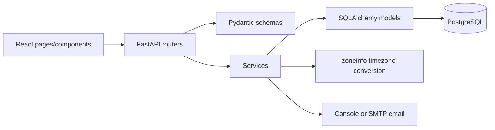

# Architecture

## Overview

The Codeyoung Trial Class Booking System is implemented as a modular monolith. It utilizes a layered application architecture: React/Vite presents public and staff views, FastAPI exposes HTTP routes, services manage orchestration and business rules, SQLAlchemy models map PostgreSQL data, and a notification service handles email delivery after booking commit.

## Frontend

The frontend is a React application bundled with Vite.

- **`src/App.jsx`**: Controls routing between the public landing, booking flow, and the Staff Portal (Admin and Mentor views).
- **`pages/`**: Contains page-level layouts and orchestration.
- **`components/`**: Houses reusable UI elements, including forms, slot selection grids, confirmation dialogs, landing content, and staff dashboards.
- **`api/`**: Centralizes external API fetch calls to the backend.
- **`utils/dateUtils.js`**: Contains local date and timezone format helpers.
- **`index.css`**: Provides vanilla CSS styling for the application.

## Backend

The backend is built with FastAPI and strictly adheres to a service-oriented modular monolith pattern:

- **`main.py`**: Initializes the FastAPI application, configures CORS, provides the health route, and registers routers.
- **`routers/`**: Handles HTTP parameters, requests, Pydantic validation, and status-code translation. Routers do not contain core business logic.
- **`schemas/`**: Defines Pydantic data validation and serialization contracts for incoming requests and outgoing responses.
- **`services/`**: The core business layer. Contains decoupled modules for bookings, timezones, courses, parents, email notifications, and admin operations.
- **`models/`**: SQLAlchemy Object Relational Mapping (ORM) entities representing the database schema.
- **`db/`**: Contains table creation initialization and idempotent data seeding/migration scripts.

### Actual Services
- **Booking Service**: Handles mentor allocation, slot availability checking, daily capacity calculations, and booking creation validation.
- **Slot/Timezone Service**: Generates IST anchors, performs UTC conversions, IANA timezone parsing, and DST handling.
- **Course Service**: Manages active course retrieval and course validation logic.
- **Parent Service**: Manages parent lookup and normalization creation.
- **Admin Service**: Coordinates operational logic, including mentor CRUD, mentor capacity views, and parent/booking analytics.
- **Email Service**: Formats and dispatches parent and mentor notifications with dual-timezone rendering, using either console simulation or an external SMTP backend.

## Request Flow

A typical operation in the system follows this layered progression:

**React → FastAPI router → Pydantic schema validation → Service layer → Database → API response**

### Booking Flow Example
1. **Course & Slot Selection**: React requests active courses and available slots.
2. **Booking Submission**: React submits a booking request containing parent details, course ID, selected IANA timezone, and the canonical UTC slot.
3. **Router**: FastAPI parses and validates the JSON body using Pydantic.
4. **Validation**: The service validates the inputs, verifying course availability, timezone validity, and slot window constraints.
5. **Mentor Eligibility**: Active mentors are filtered. Any mentors already booked at the exact slot, or who have already reached their capacity for the mapped IST calendar date, are excluded.
6. **Mentor Assignment**: An eligible mentor is deterministically selected based on the lowest mentor ID.
7. **Transaction**: A database session opens. The system requests PostgreSQL `SERIALIZABLE` isolation.
8. **Booking Creation**: The normalized parent is created or retrieved, and the new booking record is committed.
9. **Notification**: The email service dispatches confirmations to both parent and mentor.
10. **Confirmation**: A successful HTTP 201 response returns the generated classroom link to the frontend.

## Concurrency

The system is designed to handle concurrent booking requests defensively:

- **PostgreSQL `SERIALIZABLE` Isolation**: Prevents race conditions during mentor capacity and eligibility evaluation.
- **Unique Mentor+Slot Constraint**: A strict `uq_mentor_slot_utc` database-level constraint physically prevents double-booking a mentor into the exact same slot.
- **Retry Handling**: The backend automatically captures and retries retryable serialization or constraint conflicts once, smoothing out concurrent spikes without failing the parent's request.
- **Daily Capacity Calculation**: Mentors are strictly limited to a maximum of 2 confirmed classes per IST calendar date, evaluated live during the transaction.

## Timezone Architecture

- **Asia/Kolkata Reference**: Mentor scheduling, available hours, and capacity limits are firmly anchored in the `Asia/Kolkata` timezone.
- **UTC Canonical Storage**: All booking slots are stored in the database as single, unambiguous canonical UTC instants (`TIMESTAMPTZ`).
- **IANA Timezone Conversion**: Timezones are strictly defined using IANA strings (e.g., `America/New_York`).
- **DST Handling**: Python's `zoneinfo` and `tzdata` apply dynamic Daylight Saving Time offsets without manual arithmetic.
- **Parent-Local Display**: Available slots are converted dynamically into the parent's chosen timezone prior to API delivery.
- **Dual Email Timezones**: The Parent notification is rendered in their local timezone. The assigned Mentor receives their notification mapped to `Asia/Kolkata`.

*(Note: The system implements a modular monolith; there are no independent microservices by design.)*
