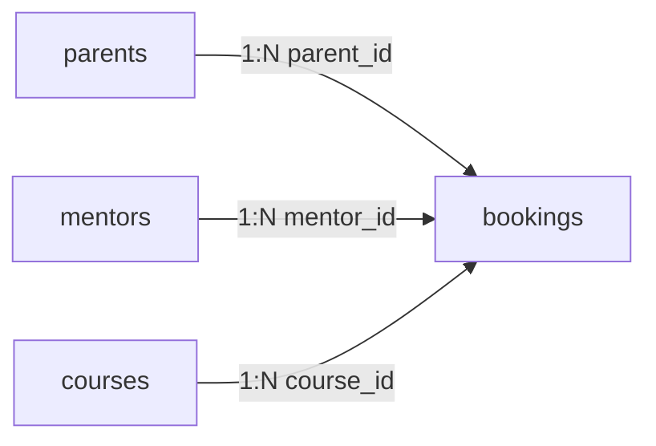

# Database

The Codeyoung Trial Class Booking System relies on PostgreSQL as its persistence layer, managed via the SQLAlchemy ORM.

## Schema Overview

The database is built on four core normalized tables: `parents`, `mentors`, `courses`, and `bookings`. All date/time fields (`created_at`, `slot_utc`) are stored as timezone-aware `TIMESTAMPTZ` values, strictly enforcing UTC at rest.

## Tables

### `parents`

Stores the normalized identity of the parent booking the class. One parent may have multiple bookings.

- `id`: Integer, Primary Key, Indexed.
- `name`: String(100), Not Null.
- `email`: String(150), Not Null, Unique, Indexed.
- `created_at`: DateTime(timezone=True), Not Null, Default `func.now()`.

### `mentors`

Stores the identity and capacity states of the system's teaching staff. The system seeds 10 fictional active `Asia/Kolkata` mentors during initialization.

- `id`: Integer, Primary Key, Indexed.
- `name`: String(100), Not Null.
- `email`: String(150), Not Null, Unique, Indexed.
- `timezone`: String(50), Not Null, Default `"Asia/Kolkata"`.
- `is_active`: Boolean, Not Null, Default `True`.

### `courses`

Defines the available classes that a parent can select. Seven default courses are seeded.

- `id`: Integer, Primary Key, Indexed.
- `name`: String(150), Not Null, Unique.
- `description`: String(500), Not Null.
- `age_range`: String(50), Not Null, Default `"All Ages"`.
- `level`: String(50), Not Null, Default `"All Levels"`.
- `is_active`: Boolean, Not Null, Default `True`.
- `created_at`: DateTime(timezone=True), Not Null, Default `func.now()`.

### `bookings`

The central junction entity binding a parent, course, and mentor to a specific appointment instant.

- `id`: Integer, Primary Key, Indexed.
- `parent_id`: Integer, Foreign Key (`parents.id`), Not Null, `ON DELETE RESTRICT`, Indexed.
- `mentor_id`: Integer, Foreign Key (`mentors.id`), Not Null, `ON DELETE RESTRICT`, Indexed.
- `course_id`: Integer, Foreign Key (`courses.id`), Not Null, `ON DELETE RESTRICT`, Indexed.
- `child_name`: String(100), Not Null.
- `parent_timezone`: String(50), Not Null.
- `slot_utc`: DateTime(timezone=True), Not Null. (This is the canonical UTC booking instant).
- `class_link`: String(255), Not Null. (Generated UUID dummy link).
- `status`: String(20), Not Null, Default `"confirmed"`.
- `created_at`: DateTime(timezone=True), Not Null, Default `func.now()`.

## Integrity and Constraints

- **Foreign Keys**: Bookings strictly restrict deletion (`ON DELETE RESTRICT`). You cannot delete a mentor, parent, or course if a booking historically references them. The frontend and backend instruct administrators to deactivate entities instead.
- **Double-Booking Guard**: The `bookings` table explicitly implements `UniqueConstraint("mentor_id", "slot_utc", name="uq_mentor_slot_utc")`. This physically prevents PostgreSQL from allowing the same mentor to be scheduled for the same exact UTC hour.
- **Capacity**: The maximum limit of 2 classes per mentor per IST day is evaluated dynamically at runtime by grouping `slot_utc` converted to the IST calendar date.

## Initialization and Migration

The project utilizes raw SQLAlchemy metadata generation (`Base.metadata.create_all()`) combined with idempotent initialization and seed Python scripts (`db/init_db.py`, `db/seed.py`, `db/migrate_phase_a.py`). **Alembic is not utilized** in this implementation to keep setup dependencies simple.
